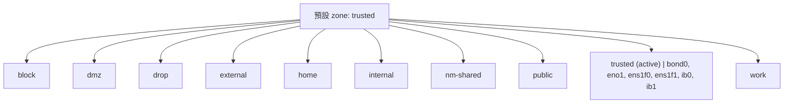
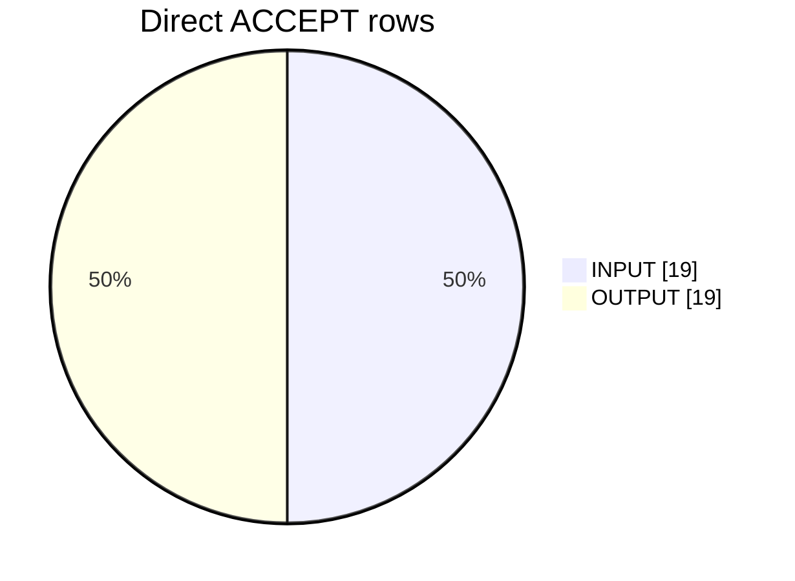

# fwctl 防火牆快照

- **產生時間**：`2026-04-15T06:14:07Z`
- **後端**：`firewall-cmd`
- **schema**：`2`

> Mermaid 圖在 GitHub／GitLab／部分編輯器可預覽；純文字檢視可略過程式碼塊。

## Zone／介面拓樸（Mermaid）



## Runtime vs Permanent（services／ports drift）

| Zone | 僅 runtime services | 僅 permanent services | 僅 runtime ports | 僅 permanent ports | 摘要 |
| --- | --- | --- | --- | --- | --- |
| block | — | — | — | — | 一致 |
| dmz | — | — | — | — | 一致 |
| drop | — | — | — | — | 一致 |
| external | — | — | — | — | 一致 |
| home | — | — | — | — | 一致 |
| internal | — | — | — | — | 一致 |
| nm-shared | — | — | — | — | 一致 |
| public | — | — | — | — | 一致 |
| trusted | — | — | — | — | 一致 |
| work | — | — | — | — | 一致 |


## ipset 名稱

- **ipsets（runtime）**：3D-Server, IBinside, INLNDTMV, OUTLNDTMV, RSHinside, SSHinside, httpws, ssh-in, ssh-out
- **ipsets（permanent）**：3D-Server, IBinside, INLNDTMV, OUTLNDTMV, RSHinside, SSHinside, httpws, ssh-in, ssh-out

## ipset 名稱分布（Mermaid）


### ipset 詳情（runtime）

| 名稱 | info 首行／錯誤 | 條目數 | 濃縮預覽 |
| --- | --- | --- | --- |
| 3D-Server | 3D-Server | 3 | 172.16.66.[4,5,11]（濃縮後 1 段；原始 3 筆） |
| IBinside | IBinside | 204 | 192.168.58.[1-4,9-12,17-34,41-58,65-144], 192.168.59.[1-8,13-20,25-32,37-44,49-56,61-68,73-80,85-92,97-104,109-116]（濃縮後 2 段；原始 204 筆） |
| INLNDTMV | INLNDTMV | 14 | 172.16.90.[101-107,151-157]（濃縮後 1 段；原始 14 筆） |
| OUTLNDTMV | OUTLNDTMV | 7 | 10.6.90.[101-103,151-153], 172.16.70.71（濃縮後 2 段；原始 7 筆） |
| RSHinside | RSHinside | 1 | 172.16.7.32（濃縮後 1 段；原始 1 筆） |
| SSHinside | SSHinside | 8 | 61.56.15.233, 172.16.20.[21,22,41], 172.16.24.[1,3], 192.168.202.[28,29]（濃縮後 4 段；原始 8 筆） |
| httpws | httpws | 6 | 61.56.13.[38,88], 172.16.9.25, 172.16.31.120, 172.16.70.[50,95]（濃縮後 4 段；原始 6 筆） |
| ssh-in | ssh-in | 73 | 10.6.90.[101-103], 10.170.3.33, 10.170.4.34, 61.56.11.[49,51,77], 61.56.13.[38,47,52,54,86-88,168], 163.29.179.165, 172.16.6.[70,100-104], 172.16.7.192, 172.16.9.[7,8,14,18-20,25,26,35,59-62,129,130,132-136], 172.16.20.[41,46,110], 172.16.21.78, 172.16.24.[1-3] …（濃縮後 19 段；原始 73 筆） |
| ssh-out | ssh-out | 54 | 10.6.90.[101-103], 61.56.11.[49,51,77], 61.56.13.[38,47,52,54,86-88,168], 163.29.179.165, 172.16.9.[7,8,14,18-20,25,26,35,59-62,129,130,132-136], 172.16.20.[41,46,47], 172.16.21.78, 172.16.24.[1-3], 172.16.30.[24,25,99,150,180], 172.16.31.120, 172.16.66.[27,80], 172.16.107.[33,34,41,42]（濃縮後 12 段；原始 54 筆） |

### ipset 詳情（permanent）

| 名稱 | info 首行／錯誤 | 條目數 | 濃縮預覽 |
| --- | --- | --- | --- |
| 3D-Server | 3D-Server | 3 | 172.16.66.[4,5,11]（濃縮後 1 段；原始 3 筆） |
| IBinside | IBinside | 204 | 192.168.58.[1-4,9-12,17-34,41-58,65-144], 192.168.59.[1-8,13-20,25-32,37-44,49-56,61-68,73-80,85-92,97-104,109-116]（濃縮後 2 段；原始 204 筆） |
| INLNDTMV | INLNDTMV | 14 | 172.16.90.[101-107,151-157]（濃縮後 1 段；原始 14 筆） |
| OUTLNDTMV | OUTLNDTMV | 7 | 10.6.90.[101-103,151-153], 172.16.70.71（濃縮後 2 段；原始 7 筆） |
| RSHinside | RSHinside | 1 | 172.16.7.32（濃縮後 1 段；原始 1 筆） |
| SSHinside | SSHinside | 8 | 61.56.15.233, 172.16.20.[21,22,41], 172.16.24.[1,3], 192.168.202.[28,29]（濃縮後 4 段；原始 8 筆） |
| httpws | httpws | 6 | 61.56.13.[38,88], 172.16.9.25, 172.16.31.120, 172.16.70.[50,95]（濃縮後 4 段；原始 6 筆） |
| ssh-in | ssh-in | 73 | 10.6.90.[101-103], 10.170.3.33, 10.170.4.34, 61.56.11.[49,51,77], 61.56.13.[38,47,52,54,86-88,168], 163.29.179.165, 172.16.6.[70,100-104], 172.16.7.192, 172.16.9.[7,8,14,18-20,25,26,35,59-62,129,130,132-136], 172.16.20.[41,46,110], 172.16.21.78, 172.16.24.[1-3] …（濃縮後 19 段；原始 73 筆） |
| ssh-out | ssh-out | 54 | 10.6.90.[101-103], 61.56.11.[49,51,77], 61.56.13.[38,47,52,54,86-88,168], 163.29.179.165, 172.16.9.[7,8,14,18-20,25,26,35,59-62,129,130,132-136], 172.16.20.[41,46,47], 172.16.21.78, 172.16.24.[1-3], 172.16.30.[24,25,99,150,180], 172.16.31.120, 172.16.66.[27,80], 172.16.107.[33,34,41,42]（濃縮後 12 段；原始 54 筆） |


## Direct 允許流量摘要（INPUT／OUTPUT）

> 由 `direct_rules_parsed`（僅 `-j ACCEPT`）與 `ipsets.details` 對照；不含 zone／rich rules。



> 僅掃描 ``-j ACCEPT`` 且 ``parse_error=false`` 的 direct 規則；常見 ``-s/-d/-p/--dport/--sport/--dports/--sports`` 與 ``-m set --match-set``。非完整 iptables／nft 語意，若有自訂 match 可能漏欄。

> 解析統計：ACCEPT 列 38；略過非 ACCEPT 6；略過解析失敗 0。

### INPUT（-j ACCEPT）

| prio | fam | table | 來源 -s | 目的 -d | -p | dport | sport | -i | -o | ipset | ipset 摘要 | raw |
| --- | --- | --- | --- | --- | --- | --- | --- | --- | --- | --- | --- | --- |
| 100 | ipv4 | filter | — | — | — | — | — | lo | — | — | — | ipv4 filter INPUT 100 -i lo -j ACCEPT |
| 110 | ipv4 | filter | — | — | tcp | — | — | — | — | — | — | ipv4 filter INPUT 110 -p tcp -m state --state ESTABLISHED -j ACCEPT |
| 190 | ipv4 | filter | — | — | tcp | 113, 512 | — | — | — | — | — | ipv4 filter INPUT 190 -p tcp -m multiport --dports 113,512 -j ACCEPT |
| 210 | ipv4 | filter | 192.168.50.0/23 | — | — | — | — | — | — | — | — | ipv4 filter INPUT 210 -s 192.168.50.0/23 -j ACCEPT |
| 220 | ipv4 | filter | — | — | — | — | — | — | — | IBinside(src) | IBinside: 192.168.58.[1-4,9-12,17-34,41-58,65-144], 192.168.59.[1-8,13-20,25-32,37-44,49-56,61-68,73-80,85-92,97-104,109-116]（濃縮後 2 段；原始 204 筆） | ipv4 filter INPUT 220 -m set --match-set IBinside src -j ACCEPT |
| 230 | ipv4 | filter | 10.96.0.0/16 | — | — | — | — | — | — | — | — | ipv4 filter INPUT 230 -s 10.96.0.0/16 -j ACCEPT |
| 240 | ipv4 | filter | 10.97.0.0/16 | — | — | — | — | — | — | — | — | ipv4 filter INPUT 240 -s 10.97.0.0/16 -j ACCEPT |
| 250 | ipv4 | filter | 10.112.0.0/16 | — | — | — | — | — | — | — | — | ipv4 filter INPUT 250 -s 10.112.0.0/16 -j ACCEPT |
| 260 | ipv4 | filter | 10.113.0.0/16 | — | — | — | — | — | — | — | — | ipv4 filter INPUT 260 -s 10.113.0.0/16 -j ACCEPT |
| 270 | ipv4 | filter | 172.16.65.1 | — | udp | — | 53 | — | — | — | — | ipv4 filter INPUT 270 -p udp -s 172.16.65.1 --sport 53 -j ACCEPT |
| 280 | ipv4 | filter | 172.16.20.80 | — | udp | 161 | — | — | — | — | — | ipv4 filter INPUT 280 -p udp -s 172.16.20.80 --dport 161 -j ACCEPT |
| 301 | ipv4 | filter | 10.6.1.200 | — | tcp | — | 17005, 17007, 18002 | — | — | — | — | ipv4 filter INPUT 301 -p tcp -s 10.6.1.200 -m multiport --sports 17005,17007,18002 -j ACCEPT |
| 301 | ipv4 | filter | 172.16.20.21 | — | tcp | 20, 21 | — | — | — | — | — | ipv4 filter INPUT 301 -p tcp -s 172.16.20.21 -m multiport --dports 20,21 -j ACCEPT |
| 302 | ipv4 | filter | 172.16.20.22 | — | tcp | 20, 21 | — | — | — | — | — | ipv4 filter INPUT 302 -p tcp -s 172.16.20.22 -m multiport --dports 20,21 -j ACCEPT |
| 512 | ipv4 | filter | — | — | tcp | — | — | — | — | INLNDTMV(src) | INLNDTMV: 172.16.90.[101-107,151-157]（濃縮後 1 段；原始 14 筆） | ipv4 filter INPUT 512 -p tcp -m set --match-set INLNDTMV src -j ACCEPT |
| 512 | ipv4 | filter | — | — | tcp | — | — | — | — | OUTLNDTMV(src) | OUTLNDTMV: 10.6.90.[101-103,151-153], 172.16.70.71（濃縮後 2 段；原始 7 筆） | ipv4 filter INPUT 512 -p tcp -m set --match-set OUTLNDTMV src -j ACCEPT |
| 512 | ipv4 | filter | — | — | tcp | 22 | — | — | — | ssh-in(src) | ssh-in: 10.6.90.[101-103], 10.170.3.33, 10.170.4.34, 61.56.11.[49,51,77], 61.56.13.[38,47,52,54,86-88,168], 163.29.179.165, 172.16.6.[70,100-104], 172.16.7.192, 172.16.9.[7,8,14,18-20,25,26,35,59-62,1 | ipv4 filter INPUT 512 -p tcp -m set --match-set ssh-in src --dport 22 -j ACCEPT |
| 605 | ipv4 | filter | — | — | tcp | 80,443 | — | — | — | httpws(src) | httpws: 61.56.13.[38,88], 172.16.9.25, 172.16.31.120, 172.16.70.[50,95]（濃縮後 4 段；原始 6 筆） | ipv4 filter INPUT 605 -p tcp -m set --match-set httpws src -m multiport --dport 80,443 -j ACCEPT |
| 997 | ipv4 | filter | — | — | icmp | — | — | — | — | — | — | ipv4 filter INPUT 997 -p icmp -j ACCEPT |

### OUTPUT（-j ACCEPT）

| prio | fam | table | 來源 -s | 目的 -d | -p | dport | sport | -i | -o | ipset | ipset 摘要 | raw |
| --- | --- | --- | --- | --- | --- | --- | --- | --- | --- | --- | --- | --- |
| 100 | ipv4 | filter | — | — | — | — | — | — | lo | — | — | ipv4 filter OUTPUT 100 -o lo -j ACCEPT |
| 110 | ipv4 | filter | — | — | tcp | — | — | — | — | — | — | ipv4 filter OUTPUT 110 -p tcp -m state --state ESTABLISHED -j ACCEPT |
| 190 | ipv4 | filter | — | — | tcp | 113, 512 | — | — | — | — | — | ipv4 filter OUTPUT 190 -p tcp -m multiport --dports 113,512 -j ACCEPT |
| 200 | ipv4 | filter | — | 172.16.65.1 | udp | 53 | — | — | — | — | — | ipv4 filter OUTPUT 200 -p udp -d 172.16.65.1 --dport 53 -j ACCEPT |
| 210 | ipv4 | filter | — | 192.168.50.0/23 | — | — | — | — | — | — | — | ipv4 filter OUTPUT 210 -d 192.168.50.0/23 -j ACCEPT |
| 220 | ipv4 | filter | — | — | — | — | — | — | — | IBinside(dst) | IBinside: 192.168.58.[1-4,9-12,17-34,41-58,65-144], 192.168.59.[1-8,13-20,25-32,37-44,49-56,61-68,73-80,85-92,97-104,109-116]（濃縮後 2 段；原始 204 筆） | ipv4 filter OUTPUT 220 -m set --match-set IBinside dst -j ACCEPT |
| 221 | ipv4 | filter | — | — | tcp | 21, 22 | — | — | — | 3D-Server(src) | 3D-Server: 172.16.66.[4,5,11]（濃縮後 1 段；原始 3 筆） | ipv4 filter OUTPUT 221 -p tcp -m set --match-set 3D-Server src -m tcp -m multiport --dports 21,22 -j ACCEPT |
| 230 | ipv4 | filter | — | 10.96.0.0/16 | — | — | — | — | — | — | — | ipv4 filter OUTPUT 230 -d 10.96.0.0/16 -j ACCEPT |
| 240 | ipv4 | filter | — | 10.97.0.0/16 | — | — | — | — | — | — | — | ipv4 filter OUTPUT 240 -d 10.97.0.0/16 -j ACCEPT |
| 250 | ipv4 | filter | — | 10.112.0.0/16 | — | — | — | — | — | — | — | ipv4 filter OUTPUT 250 -d 10.112.0.0/16 -j ACCEPT |
| 260 | ipv4 | filter | — | 10.113.0.0/16 | — | — | — | — | — | — | — | ipv4 filter OUTPUT 260 -d 10.113.0.0/16 -j ACCEPT |
| 280 | ipv4 | filter | — | 172.16.20.80 | udp | — | 161 | — | — | — | — | ipv4 filter OUTPUT 280 -p udp -d 172.16.20.80 --sport 161 -j ACCEPT |
| 301 | ipv4 | filter | — | 10.6.1.200 | tcp | 9218, 15003, 15008, 17001, 17003, 17005, 17007, 18002 | — | — | — | — | — | ipv4 filter OUTPUT 301 -p tcp -d 10.6.1.200 -m multiport --dports 9218,15003,15008,17001,17003,17005,17007,18002 -j ACCEPT |
| 306 | ipv4 | filter | — | 172.16.20.26 | udp | 514 | — | — | — | — | — | ipv4 filter OUTPUT 306 -p udp -d 172.16.20.26 --dport 514 -j ACCEPT |
| 512 | ipv4 | filter | — | — | tcp | — | — | — | — | INLNDTMV(dst) | INLNDTMV: 172.16.90.[101-107,151-157]（濃縮後 1 段；原始 14 筆） | ipv4 filter OUTPUT 512 -p tcp -m set --match-set INLNDTMV dst -j ACCEPT |
| 512 | ipv4 | filter | — | — | tcp | — | — | — | — | OUTLNDTMV(dst) | OUTLNDTMV: 10.6.90.[101-103,151-153], 172.16.70.71（濃縮後 2 段；原始 7 筆） | ipv4 filter OUTPUT 512 -p tcp -m set --match-set OUTLNDTMV dst -j ACCEPT |
| 512 | ipv4 | filter | — | — | tcp | 22 | — | — | — | ssh-out(dst) | ssh-out: 10.6.90.[101-103], 61.56.11.[49,51,77], 61.56.13.[38,47,52,54,86-88,168], 163.29.179.165, 172.16.9.[7,8,14,18-20,25,26,35,59-62,129,130,132-136], 172.16.20.[41,46,47], 172.16.21.78, 172.16.24 | ipv4 filter OUTPUT 512 -p tcp -m set --match-set ssh-out dst --dport 22 -j ACCEPT |
| 605 | ipv4 | filter | — | — | tcp | 80,443 | — | — | — | httpws(dst) | httpws: 61.56.13.[38,88], 172.16.9.25, 172.16.31.120, 172.16.70.[50,95]（濃縮後 4 段；原始 6 筆） | ipv4 filter OUTPUT 605 -p tcp -m set --match-set httpws dst -m multiport --dport 80,443 -j ACCEPT |
| 997 | ipv4 | filter | — | — | icmp | — | — | — | — | — | — | ipv4 filter OUTPUT 997 -p icmp -j ACCEPT |

### FORWARD（-j ACCEPT）

—

### 其它 chain（-j ACCEPT）

—


## Direct 規則（全列）

> 下列流程圖僅輔助閱讀，不代表 netfilter 實際順序。

```mermaid
flowchart TB
  subgraph Z_dir_ipv4_filter_INPUT["ipv4 / filter / INPUT（共 22 條）"]
    direction TB
    DR0["-5: -p icmp --icmp-type timestamp-request -j DROP"]
    DR1["100: -i lo -j ACCEPT"]
    DR0 --> DR1
    DR2["110: -p tcp -m state --state ESTABLISHED -j ACCEPT"]
    DR1 --> DR2
    DR3["190: -p tcp -m multiport --dports 113,512 -j ACCEPT"]
    DR2 --> DR3
    DR4["210: -s 192.168.50.0/23 -j ACCEPT"]
    DR3 --> DR4
    DR5["220: -m set --match-set IBinside src -j ACCEPT"]
    DR4 --> DR5
    DR6["230: -s 10.96.0.0/16 -j ACCEPT"]
    DR5 --> DR6
    DR7["240: -s 10.97.0.0/16 -j ACCEPT"]
    DR6 --> DR7
    DR8["250: -s 10.112.0.0/16 -j ACCEPT"]
    DR7 --> DR8
    DR9["260: -s 10.113.0.0/16 -j ACCEPT"]
    DR8 --> DR9
    DR10["270: -p udp -s 172.16.65.1 --sport 53 -j ACCEPT"]
    DR9 --> DR10
    DR11["280: -p udp -s 172.16.20.80 --dport 161 -j ACCEPT"]
    DR10 --> DR11
    DR12["301: -p tcp -s 10.6.1.200 -m multiport --sports 17005,17007,18002 -j ACCEPT"]
    DR11 --> DR12
    DR13["301: -p tcp -s 172.16.20.21 -m multiport --dports 20,21 -j ACCEPT"]
    DR12 --> DR13
    DR14["302: -p tcp -s 172.16.20.22 -m multiport --dports 20,21 -j ACCEPT"]
    DR13 --> DR14
    DR15["512: -p tcp -m set --match-set INLNDTMV src -j ACCEPT"]
    DR14 --> DR15
    DR16["512: -p tcp -m set --match-set OUTLNDTMV src -j ACCEPT"]
    DR15 --> DR16
    DR17["512: -p tcp -m set --match-set ssh-in src --dport 22 -j ACCEPT"]
    DR16 --> DR17
    DR18["605: -p tcp -m set --match-set httpws src -m multiport --dport 80,443 -j ACCEPT"]
    DR17 --> DR18
    DR19["997: -p icmp -j ACCEPT"]
    DR18 --> DR19
    DR20["998: -m limit --limit 2/second --limit-burst 10 -j LOG --log-prefix INPUT:"]
    DR19 --> DR20
    DR21["999: -j DROP"]
    DR20 --> DR21
  end
  subgraph Z_dir_ipv4_filter_OUTPUT["ipv4 / filter / OUTPUT（共 22 條）"]
    direction TB
    DR22["-5: -p icmp --icmp-type timestamp-reply -j DROP"]
    DR23["100: -o lo -j ACCEPT"]
    DR22 --> DR23
    DR24["110: -p tcp -m state --state ESTABLISHED -j ACCEPT"]
    DR23 --> DR24
    DR25["190: -p tcp -m multiport --dports 113,512 -j ACCEPT"]
    DR24 --> DR25
    DR26["200: -p udp -d 172.16.65.1 --dport 53 -j ACCEPT"]
    DR25 --> DR26
    DR27["210: -d 192.168.50.0/23 -j ACCEPT"]
    DR26 --> DR27
    DR28["220: -m set --match-set IBinside dst -j ACCEPT"]
    DR27 --> DR28
    DR29["221: -p tcp -m set --match-set 3D-Server src -m tcp -m multiport --dports 21,22 -j ACCEPT"]
    DR28 --> DR29
    DR30["230: -d 10.96.0.0/16 -j ACCEPT"]
    DR29 --> DR30
    DR31["240: -d 10.97.0.0/16 -j ACCEPT"]
    DR30 --> DR31
    DR32["250: -d 10.112.0.0/16 -j ACCEPT"]
    DR31 --> DR32
    DR33["260: -d 10.113.0.0/16 -j ACCEPT"]
    DR32 --> DR33
    DR34["280: -p udp -d 172.16.20.80 --sport 161 -j ACCEPT"]
    DR33 --> DR34
    DR35["301: -p tcp -d 10.6.1.200 -m multiport --dports 9218,15003,15008,17001,17003,17005,17007,18002 -j ACCEPT"]
    DR34 --> DR35
    DR36["306: -p udp -d 172.16.20.26 --dport 514 -j ACCEPT"]
    DR35 --> DR36
    DR37["512: -p tcp -m set --match-set INLNDTMV dst -j ACCEPT"]
    DR36 --> DR37
    DR38["512: -p tcp -m set --match-set OUTLNDTMV dst -j ACCEPT"]
    DR37 --> DR38
    DR39["512: -p tcp -m set --match-set ssh-out dst --dport 22 -j ACCEPT"]
    DR38 --> DR39
    DR40["605: -p tcp -m set --match-set httpws dst -m multiport --dport 80,443 -j ACCEPT"]
    DR39 --> DR40
    DR41["997: -p icmp -j ACCEPT"]
    DR40 --> DR41
    DR42["998: -m limit --limit 2/second --limit-burst 10 -j LOG --log-prefix OUTPUT:"]
    DR41 --> DR42
    DR43["999: -j DROP"]
    DR42 --> DR43
  end
```



### Direct 結構化表格

| prio | family | table | chain | rule |
| --- | --- | --- | --- | --- |
| -5 | ipv4 | filter | OUTPUT | -p icmp --icmp-type timestamp-reply -j DROP |
| 100 | ipv4 | filter | OUTPUT | -o lo -j ACCEPT |
| 110 | ipv4 | filter | OUTPUT | -p tcp -m state --state ESTABLISHED -j ACCEPT |
| 190 | ipv4 | filter | OUTPUT | -p tcp -m multiport --dports 113,512 -j ACCEPT |
| 200 | ipv4 | filter | OUTPUT | -p udp -d 172.16.65.1 --dport 53 -j ACCEPT |
| 210 | ipv4 | filter | OUTPUT | -d 192.168.50.0/23 -j ACCEPT |
| 220 | ipv4 | filter | OUTPUT | -m set --match-set IBinside dst -j ACCEPT |
| 221 | ipv4 | filter | OUTPUT | -p tcp -m set --match-set 3D-Server src -m tcp -m multiport --dports 21,22 -j ACCEPT |
| 230 | ipv4 | filter | OUTPUT | -d 10.96.0.0/16 -j ACCEPT |
| 240 | ipv4 | filter | OUTPUT | -d 10.97.0.0/16 -j ACCEPT |
| 250 | ipv4 | filter | OUTPUT | -d 10.112.0.0/16 -j ACCEPT |
| 260 | ipv4 | filter | OUTPUT | -d 10.113.0.0/16 -j ACCEPT |
| 280 | ipv4 | filter | OUTPUT | -p udp -d 172.16.20.80 --sport 161 -j ACCEPT |
| 301 | ipv4 | filter | OUTPUT | -p tcp -d 10.6.1.200 -m multiport --dports 9218,15003,15008,17001,17003,17005,17007,18002 -j ACCEPT |
| 306 | ipv4 | filter | OUTPUT | -p udp -d 172.16.20.26 --dport 514 -j ACCEPT |
| 512 | ipv4 | filter | OUTPUT | -p tcp -m set --match-set INLNDTMV dst -j ACCEPT |
| 512 | ipv4 | filter | OUTPUT | -p tcp -m set --match-set OUTLNDTMV dst -j ACCEPT |
| 512 | ipv4 | filter | OUTPUT | -p tcp -m set --match-set ssh-out dst --dport 22 -j ACCEPT |
| 605 | ipv4 | filter | OUTPUT | -p tcp -m set --match-set httpws dst -m multiport --dport 80,443 -j ACCEPT |
| 997 | ipv4 | filter | OUTPUT | -p icmp -j ACCEPT |
| 998 | ipv4 | filter | OUTPUT | -m limit --limit 2/second --limit-burst 10 -j LOG --log-prefix OUTPUT:  |
| 999 | ipv4 | filter | OUTPUT | -j DROP |
| -5 | ipv4 | filter | INPUT | -p icmp --icmp-type timestamp-request -j DROP |
| 100 | ipv4 | filter | INPUT | -i lo -j ACCEPT |
| 110 | ipv4 | filter | INPUT | -p tcp -m state --state ESTABLISHED -j ACCEPT |
| 190 | ipv4 | filter | INPUT | -p tcp -m multiport --dports 113,512 -j ACCEPT |
| 210 | ipv4 | filter | INPUT | -s 192.168.50.0/23 -j ACCEPT |
| 220 | ipv4 | filter | INPUT | -m set --match-set IBinside src -j ACCEPT |
| 230 | ipv4 | filter | INPUT | -s 10.96.0.0/16 -j ACCEPT |
| 240 | ipv4 | filter | INPUT | -s 10.97.0.0/16 -j ACCEPT |
| 250 | ipv4 | filter | INPUT | -s 10.112.0.0/16 -j ACCEPT |
| 260 | ipv4 | filter | INPUT | -s 10.113.0.0/16 -j ACCEPT |
| 270 | ipv4 | filter | INPUT | -p udp -s 172.16.65.1 --sport 53 -j ACCEPT |
| 280 | ipv4 | filter | INPUT | -p udp -s 172.16.20.80 --dport 161 -j ACCEPT |
| 301 | ipv4 | filter | INPUT | -p tcp -s 10.6.1.200 -m multiport --sports 17005,17007,18002 -j ACCEPT |
| 301 | ipv4 | filter | INPUT | -p tcp -s 172.16.20.21 -m multiport --dports 20,21 -j ACCEPT |
| 302 | ipv4 | filter | INPUT | -p tcp -s 172.16.20.22 -m multiport --dports 20,21 -j ACCEPT |
| 512 | ipv4 | filter | INPUT | -p tcp -m set --match-set INLNDTMV src -j ACCEPT |
| 512 | ipv4 | filter | INPUT | -p tcp -m set --match-set OUTLNDTMV src -j ACCEPT |
| 512 | ipv4 | filter | INPUT | -p tcp -m set --match-set ssh-in src --dport 22 -j ACCEPT |
| 605 | ipv4 | filter | INPUT | -p tcp -m set --match-set httpws src -m multiport --dport 80,443 -j ACCEPT |
| 997 | ipv4 | filter | INPUT | -p icmp -j ACCEPT |
| 998 | ipv4 | filter | INPUT | -m limit --limit 2/second --limit-burst 10 -j LOG --log-prefix INPUT:  |
| 999 | ipv4 | filter | INPUT | -j DROP |

### 原始 `--get-all-rules` 行

```text
ipv4 filter OUTPUT -5 -p icmp --icmp-type timestamp-reply -j DROP
ipv4 filter OUTPUT 100 -o lo -j ACCEPT
ipv4 filter OUTPUT 110 -p tcp -m state --state ESTABLISHED -j ACCEPT
ipv4 filter OUTPUT 190 -p tcp -m multiport --dports 113,512 -j ACCEPT
ipv4 filter OUTPUT 200 -p udp -d 172.16.65.1 --dport 53 -j ACCEPT
ipv4 filter OUTPUT 210 -d 192.168.50.0/23 -j ACCEPT
ipv4 filter OUTPUT 220 -m set --match-set IBinside dst -j ACCEPT
ipv4 filter OUTPUT 221 -p tcp -m set --match-set 3D-Server src -m tcp -m multiport --dports 21,22 -j ACCEPT
ipv4 filter OUTPUT 230 -d 10.96.0.0/16 -j ACCEPT
ipv4 filter OUTPUT 240 -d 10.97.0.0/16 -j ACCEPT
ipv4 filter OUTPUT 250 -d 10.112.0.0/16 -j ACCEPT
ipv4 filter OUTPUT 260 -d 10.113.0.0/16 -j ACCEPT
ipv4 filter OUTPUT 280 -p udp -d 172.16.20.80 --sport 161 -j ACCEPT
ipv4 filter OUTPUT 301 -p tcp -d 10.6.1.200 -m multiport --dports 9218,15003,15008,17001,17003,17005,17007,18002 -j ACCEPT
ipv4 filter OUTPUT 306 -p udp -d 172.16.20.26 --dport 514 -j ACCEPT
ipv4 filter OUTPUT 512 -p tcp -m set --match-set INLNDTMV dst -j ACCEPT
ipv4 filter OUTPUT 512 -p tcp -m set --match-set OUTLNDTMV dst -j ACCEPT
ipv4 filter OUTPUT 512 -p tcp -m set --match-set ssh-out dst --dport 22 -j ACCEPT
ipv4 filter OUTPUT 605 -p tcp -m set --match-set httpws dst -m multiport --dport 80,443 -j ACCEPT
ipv4 filter OUTPUT 997 -p icmp -j ACCEPT
ipv4 filter OUTPUT 998 -m limit --limit 2/second --limit-burst 10 -j LOG --log-prefix 'OUTPUT: '
ipv4 filter OUTPUT 999 -j DROP
ipv4 filter INPUT -5 -p icmp --icmp-type timestamp-request -j DROP
ipv4 filter INPUT 100 -i lo -j ACCEPT
ipv4 filter INPUT 110 -p tcp -m state --state ESTABLISHED -j ACCEPT
ipv4 filter INPUT 190 -p tcp -m multiport --dports 113,512 -j ACCEPT
ipv4 filter INPUT 210 -s 192.168.50.0/23 -j ACCEPT
ipv4 filter INPUT 220 -m set --match-set IBinside src -j ACCEPT
ipv4 filter INPUT 230 -s 10.96.0.0/16 -j ACCEPT
ipv4 filter INPUT 240 -s 10.97.0.0/16 -j ACCEPT
ipv4 filter INPUT 250 -s 10.112.0.0/16 -j ACCEPT
ipv4 filter INPUT 260 -s 10.113.0.0/16 -j ACCEPT
ipv4 filter INPUT 270 -p udp -s 172.16.65.1 --sport 53 -j ACCEPT
ipv4 filter INPUT 280 -p udp -s 172.16.20.80 --dport 161 -j ACCEPT
ipv4 filter INPUT 301 -p tcp -s 10.6.1.200 -m multiport --sports 17005,17007,18002 -j ACCEPT
ipv4 filter INPUT 301 -p tcp -s 172.16.20.21 -m multiport --dports 20,21 -j ACCEPT
ipv4 filter INPUT 302 -p tcp -s 172.16.20.22 -m multiport --dports 20,21 -j ACCEPT
ipv4 filter INPUT 512 -p tcp -m set --match-set INLNDTMV src -j ACCEPT
ipv4 filter INPUT 512 -p tcp -m set --match-set OUTLNDTMV src -j ACCEPT
ipv4 filter INPUT 512 -p tcp -m set --match-set ssh-in src --dport 22 -j ACCEPT
ipv4 filter INPUT 605 -p tcp -m set --match-set httpws src -m multiport --dport 80,443 -j ACCEPT
ipv4 filter INPUT 997 -p icmp -j ACCEPT
ipv4 filter INPUT 998 -m limit --limit 2/second --limit-burst 10 -j LOG --log-prefix 'INPUT: '
ipv4 filter INPUT 999 -j DROP
```

